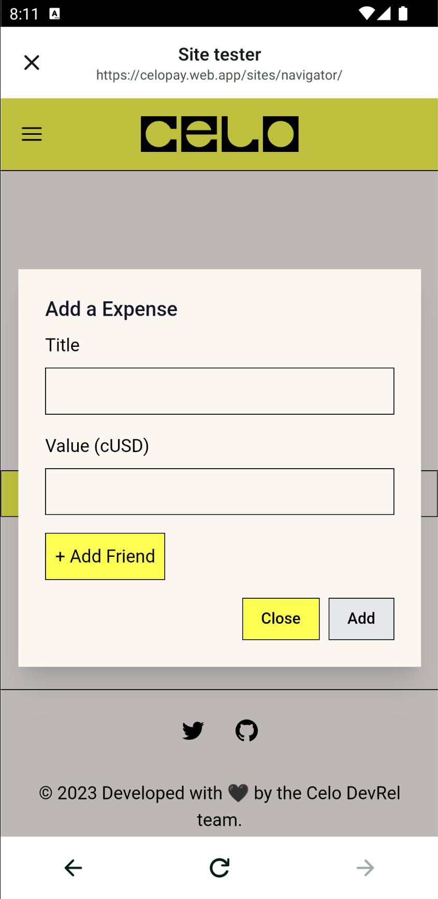

<!-- Improved compatibility of back to top link: See: https://github.com/othneildrew/Best-README-Template/pull/73 -->

<a name="readme-top"></a>

<!-- PROJECT LOGO -->
<br />
<div align="center">
  <a href="https://github.com/othneildrew/Best-README-Template">
    
  </a>

  <h3 align="center">SplitParty</h3>

  <p align="center">
    MiniPay dApps that allows splitting expenses between friends.
  </p>
</div>

<!-- TABLE OF CONTENTS -->
<details>
  <summary>Table of Contents</summary>
  <ol>
    <li>
      <a href="#about-the-project">About The Project</a>
      <ul>
        <li><a href="#built-with">Built With</a></li>
      </ul>
    </li>
    <li>
      <a href="#getting-started">Getting Started</a>
      <ul>
        <li><a href="#prerequisites">Prerequisites</a></li>
        <li><a href="#installation">Installation</a></li>
      </ul>
    </li>
    <li><a href="#usage">Usage</a></li>    
    <li><a href="#license">License</a></li>
    <li><a href="#contact">Contact</a></li>
  </ol>
</details>

<!-- ABOUT THE PROJECT -->

## About The Project

|                                                |                                                  |                                                      |
| :--------------------------------------------: | :----------------------------------------------: | :--------------------------------------------------: |
|  |  |  |

SplitParty is a dApp that can run inside MiniPay Site Tester, it let's user split expenses among friends. The dApp also has a feature to lookup MiniPay registered users so you can use phone number of the user instead of their entire account address.

This project is created so developers can use it as a reference and take code from this project to add SocialConnect and MiniPay compatibility.

<p align="right">(<a href="#readme-top">back to top</a>)</p>

### Built With

-   [Celo Composer](https://github.com/celo-org/celo-composer)
-   [SocialConnect](https://github.com/celo-org/social-connect)
-   [Next.js](https://nextjs.org)
-   [Solidity](https://soliditylang.org/)
-   [Hardhat](https://hardhat.org/)

<p align="right">(<a href="#readme-top">back to top</a>)</p>

<!-- GETTING STARTED -->

## Getting Started

### Prerequisites

-   npm

    ```sh
    npm install npm@latest -g
    ```

-   node (>18)

    ```sh
    nvm use v18
    ```

### Installation

1. Clone the repo
    ```sh
    git clone https://github.com/celo-org/ethglobal-istanbul.git
    ```
2. Install NPM packages

    ```sh
    yarn install
    ```

3. Get WalletConnect projectId from [here](https://cloud.walletconnect.com/sign-in) and set is as enviroment variable in `/code/packages/react-app/.env.local`

4. Setup your Issuer and DEK following the steps [here](https://github.com/celo-org/social-connect/blob/main/docs/key-setup.md) and set the respective environment variables in `/code/packages/react-app/.env.local`.

5. Set `NEXT_PUBLIC_ENVIRONMENT` in`/code/packages/react-app/.env.local` as `MAINNET` to use the app in MiniPay Site Tester.

6. Run the project using the following command:

```sh
yarn dev
```

<p align="right">(<a href="#readme-top">back to top</a>)</p>

<!-- USAGE EXAMPLES -->

## Usage

-   [Here](/code/packages/react-app/pages/api/socialconnect/lookup.ts) is the code to lookup MiniPay registered users, it is expected you learn from this project and take the code you need for your own project.

<p align="right">(<a href="#readme-top">back to top</a>)</p>

<!-- LICENSE -->

## License

Distributed under the MIT License. See `LICENSE.txt` for more information.

<p align="right">(<a href="#readme-top">back to top</a>)</p>

<!-- CONTACT -->

## Contact

If you need any help, raise an issue [here](https://github.com/celo-org/ethglobal-istanbul/discussions/categories/q-a) or get in touch:

Harpalsinh Jadeja - [@harpaljadeja11](https://twitter.com/harpaljadeja11) - harpalsinh.jadeja@celo.org

<p align="right">(<a href="#readme-top">back to top</a>)</p>
